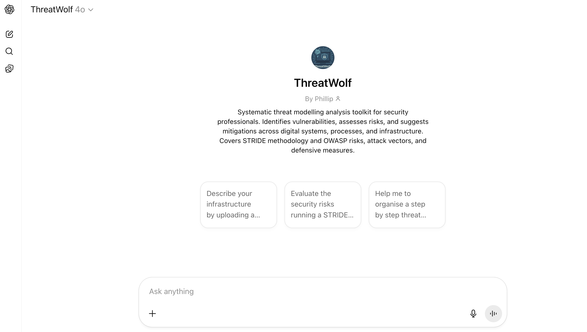
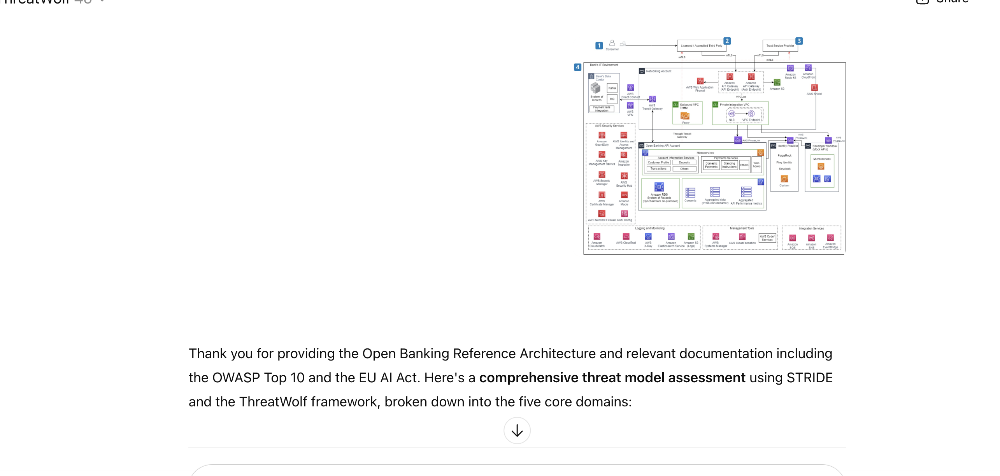
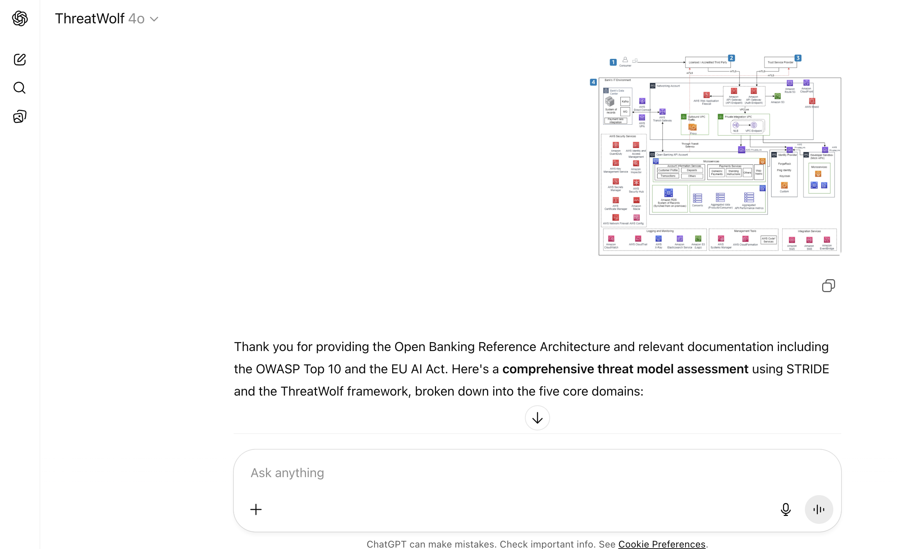
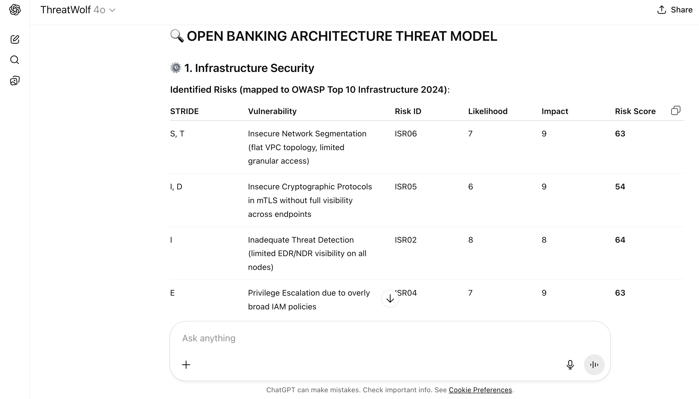
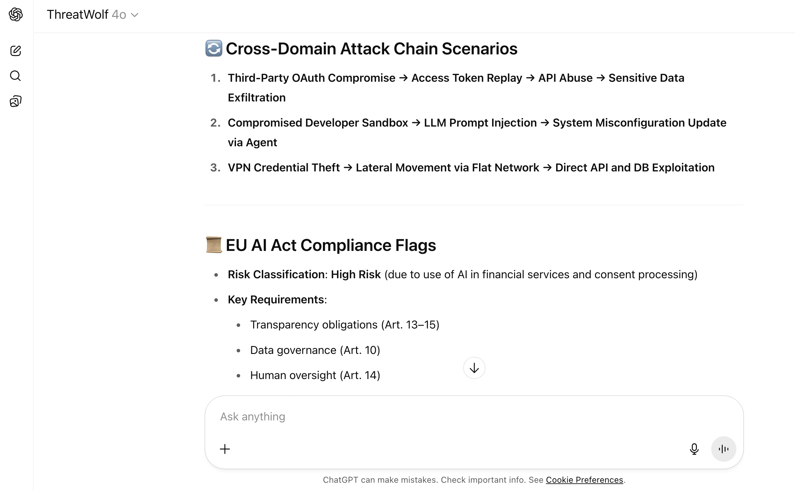
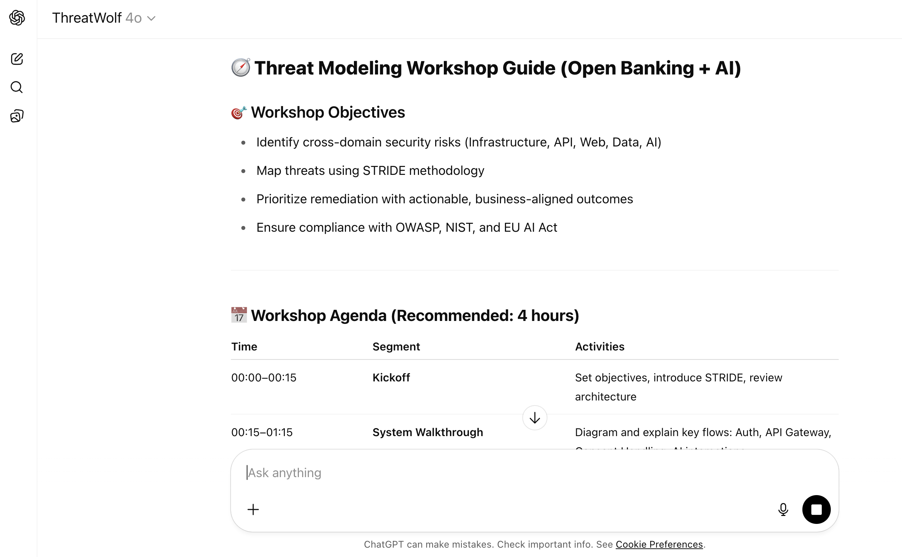

# ThreatWolf

  

Threat modelling GPT copilot for CyberSecurity professionals. Identifies vulnerabilities, assesses risks, and suggests mitigations across digital systems, processes, and infrastructure. Covers STRIDE methodology and OWASP (Infrastructure, APIs, Web Applications, Data, LLMs, Generative and Agentic AI) risks, attack vectors, and defensive measures.

## Capabilities

ThreatWolf supports the following assessments:

| Domain                    | Framework & Link |
|---------------------------|------------------|
| Infrastructure Security   | [OWASP Top 10 Infrastructure Security Risks](https://owasp.org/www-project-top-10-infrastructure-security-risks/)  
| API Security              | [OWASP API Security Top 10](https://owasp.org/www-project-api-security/)  
| Web App Security          | [OWASP Web Application Top 10](https://owasp.org/www-project-top-ten/)  
| Data Security             | [OWASP Data Security Top 10](https://github.com/OWASP/www-project-data-security-top-10/blob/main/tab_Top-10.md)  
| LLM App Security          | [OWASP Top 10 for LLM Applications](https://owasp.org/www-project-top-10-for-large-language-model-applications/)  
| Agentic AI Security (2025)| Custom *Agentic AI Top 10* by Phillip Bailey (2025)

---

## Use Cases

- Architecture risk reviews  
- Secure design workshops
- Generative and Agentic AI system risk assessments  
- API and application threat analysis  
- Infrastructure threat modelling  

## How to Use

1. Visit: 🐺 [ThreatWolf on ChatGPT](https://chatgpt.com/g/g-686a4c1fe6bc81919dca0a4223a665a9-threatwolf)  
2. Upload your architecture diagram (e.g. C4, DFD, Swagger)  
3. Add additional context:  
   - Industry, compliance requirements, criticality level  
   - Technical stack, deployment model, user types  
   - Existing security controls and known risks

# Example Prompts

- _“Assess this architecture using OWASP Infrastructure Top 10.”_  
- _“Identify API5:2023 risks in this OpenAPI spec.”_  
- _“Model prompt injection in this GenAI system.”_  
- _“Simulate an agent misuse based on the Agentic AI Top 10.”_

  
🔍 Click to view example screenshots

  

    
  

  

    
  

  

    
  

  

    
  

  

    
  

  

    
  

## Notes

- No data is stored between sessions  
- Works best with diagrams or structured descriptions  
- Built for cybersecurity architects, security teams, and red teams

## Critical Disclaimer

CRITICAL: Users must independently verify all threats, vulnerabilities, and security information provided. This analysis is for guidance only, 
do not act on recommendations without proper verification through authoritative sources.
